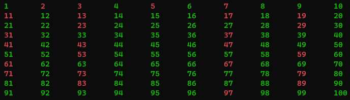

# ControleStructuren 14: Priemgetallen

Print alle getallen van 1 tem 100 in een console. Gebruik daarbij 10
rijen van telkens 10 kolommen. Print de priemgetallen in het rood, de
overige in het groen.

